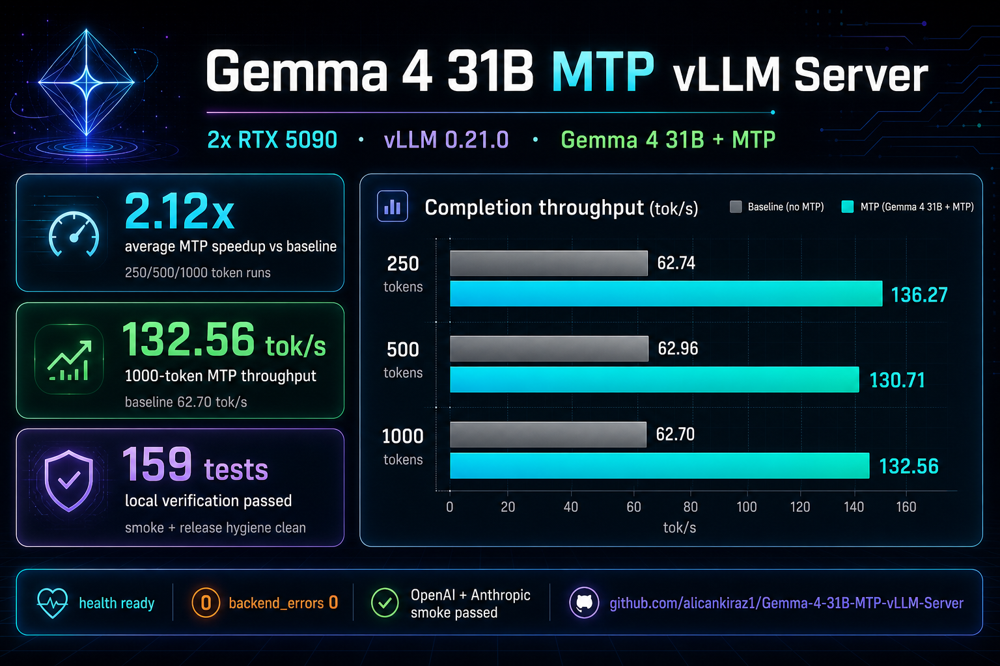
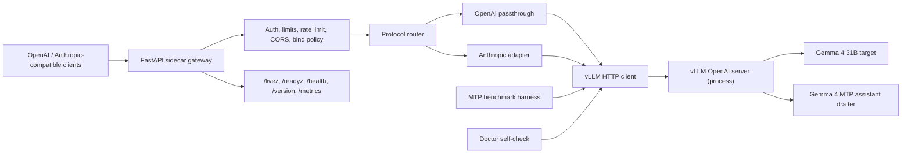

# Gemma 4 31B MTP vLLM Server

<p align="center">
  
</p>

A production-minded FastAPI sidecar for serving Gemma 4 31B on vLLM with
Gemma 4 Multi-Token Prediction (MTP) speculative decoding. It keeps the raw
`vllm serve` process private and adds OpenAI-compatible and Anthropic-compatible
HTTP APIs, API-key auth, CORS controls, rate limiting, bounded admission,
health/readiness diagnostics, release hygiene checks, and Prometheus-style
gateway metrics.

The current release is an alpha focused on local/private GPU serving. It has
been validated on a 2x NVIDIA GeForce RTX 5090 host with vLLM `0.21.0`.

## Performance Snapshot

<div align="center">


</div>

| Scenario | Baseline Gemma 4 31B | Gemma 4 31B + MTP | Improvement |
| --- | ---: | ---: | ---: |
| 250 completion tokens | 62.74 tok/s | 136.27 tok/s | 2.17x |
| 500 completion tokens | 62.96 tok/s | 130.71 tok/s | 2.08x |
| 1000 completion tokens | 62.70 tok/s | 132.56 tok/s | 2.11x |

| Validation Target | Result |
| --- | --- |
| Real hardware smoke | Passed on 2x RTX 5090 |
| Gateway health | `ready`, `version_ok: true` |
| OpenAI + Anthropic routes | Chat, stream, messages, count_tokens passed |
| Backend errors after smoke | `gemma4_mtp_backend_errors 0` |

## Verified Results

### Real Hardware Smoke

Validated on `2026-05-17` with:

- Hardware: `2x NVIDIA GeForce RTX 5090`
- Backend: `vllm 0.21.0`, tensor parallel size `2`
- Served model alias: `gemma-4-31b-mtp`
- Gateway: `127.0.0.1:18080`, upstream vLLM on `127.0.0.1:8010`

Smoke results:

- `/health`: `ready`, `version_ok: true`, backend version `0.21.0`
- `/v1/models`: returned OpenAI model objects with `display_name`
- `/v1/chat/completions`: `200 OK`
- `/v1/chat/completions` streaming: `200 OK` and `[DONE]`
- `/v1/messages`: `200 OK`
- `/v1/messages/count_tokens`: `200 OK`
- `/metrics`: `gemma4_mtp_backend_errors 0`

### MTP Throughput

Measured directly against the vLLM OpenAI endpoint with
`min_tokens=max_tokens`, `ignore_eos=true`, one warmup request, and the same
prompt for both runs.

| Completion target | MTP tok/s | Baseline tok/s | Speedup |
| --- | ---: | ---: | ---: |
| 250 tokens | 136.27 | 62.74 | 2.17x |
| 500 tokens | 130.71 | 62.96 | 2.08x |
| 1000 tokens | 132.56 | 62.70 | 2.11x |

The MTP service was restored after the benchmark and left healthy.

## Architecture



## Profiles

The default `safe80` profile targets a single 80 GB-class GPU:

- Target: `google/gemma-4-31B-it`
- Drafter: `google/gemma-4-31B-it-assistant`
- `num_speculative_tokens`: `4`
- `tensor_parallel_size`: `1`
- `gpu_memory_utilization`: `0.90`
- `max_model_len`: `32768`

A `tp2` profile is available for two 40+ GB GPUs (`tensor_parallel_size: 2`).
The live validation above used the same served alias with tensor parallelism
across two RTX 5090 GPUs.

## vLLM Requirement

The gateway requires `vllm >= 0.21.0,<0.22.0` for Gemma 4 MTP. vLLM 0.21.0
ships official Gemma 4 MTP speculative decoding support via PR #41745.
Older vLLM releases can fail during initialization or treat the Gemma 4
assistant checkpoint incorrectly. This matters because older releases can
mishandle the assistant checkpoint.

vLLM is an **optional extra** because it pulls heavy CUDA / ROCm wheels.
Install it separately on the GPU host with:

```bash
pip install "gemma4-mtp-vllm[vllm]"
```

The gateway process itself does not import `vllm`; it only talks to a
running `vllm serve` over HTTP.

## Quick Start

### Prerequisites

- Python `3.10+`. Python `3.12` recommended.
- NVIDIA CUDA driver `12.x` (CUDA 12.9 wheels available) or AMD ROCm
  `7.2.1+`. The gateway itself does not require a GPU, but `vllm serve`
  does.
- Enough VRAM for the chosen profile (`safe80` needs 80 GB, `tp2` needs
  2× 40+ GB).

### 1. Clone the repository

```bash
git clone https://github.com/alicankiraz1/Gemma-4-31B-MTP-vLLM-Server.git
cd Gemma-4-31B-MTP-vLLM-Server
```

### 2. Create and activate a virtual environment

```bash
python3.12 -m venv .venv
source .venv/bin/activate
python -m pip install --upgrade pip
```

### 3. Install the gateway

For local development (gateway + tests, without vLLM):

```bash
python -m pip install -e ".[dev]"
```

For a GPU host that will also run `vllm serve`:

```bash
python -m pip install -e ".[dev,vllm]"
```

The `[vllm]` extra installs `vllm >= 0.21.0,<0.22.0`. On NVIDIA hosts that
need the latest pre-release CUDA wheels:

```bash
uv pip install -U vllm --pre \
    --extra-index-url https://wheels.vllm.ai/nightly/cu129 \
    --extra-index-url https://download.pytorch.org/whl/cu129 \
    --index-strategy unsafe-best-match
```

### 4. Start vLLM

```bash
vllm-mtp launch --profile safe80 --host 127.0.0.1 --port 8000
```

This prints and executes the canonical `vllm serve` command for the chosen
profile, including `--speculative-config` with the Gemma 4 MTP drafter. Use
`--print-only` first to inspect the exact command:

```bash
vllm-mtp launch --profile safe80 --print-only
```

For raw vLLM exposure, keep `--host 127.0.0.1`. Passing a non-loopback host to
`vllm-mtp launch` requires `--allow-public-vllm` because raw vLLM has no gateway
auth, rate limiting, or CORS protection.

### 5. Start the gateway

```bash
vllm-mtp serve \
    --profile safe80 \
    --host 127.0.0.1 \
    --port 8080 \
    --api-key local-dev-key \
    --vllm-base-url http://127.0.0.1:8000
```

The gateway binds to `127.0.0.1` by default. Binding the gateway to `0.0.0.0`
requires an `--api-key`.

## Doctor

Verify the vLLM process is reachable, new enough for Gemma 4 MTP, and serving
the configured target model:

```bash
vllm-mtp doctor --profile safe80 --vllm-base-url http://127.0.0.1:8000
```

Expected output shape (single-line JSON):

```json
{"ok": true, "profile": "safe80", "target_model": "google/gemma-4-31B-it", "drafter": "google/gemma-4-31B-it-assistant", "drafter_configured": "google/gemma-4-31B-it-assistant", "drafter_loaded": "unknown", "num_speculative_tokens": 4, "tensor_parallel_size": 1, "gateway_version": "0.1.0", "required_vllm_min_version": "0.21.0", "vllm": {"status": "ok", "version": "0.21.0"}, "version_ok": true, "target_served": true}
```

`ok: false` indicates vLLM is unreachable, older than the required version, or
the target model is not listed in vLLM's `/v1/models`. Real vLLM reports the
served target model there; the drafter is reported as configured by this
gateway and `drafter_loaded` remains `unknown`.

## Benchmarks

The bench harness compares one vLLM process running with MTP enabled
against a second vLLM process running without `--speculative-config`. The
user is responsible for launching both processes. Example:

Terminal 1 (MTP-enabled vLLM on 8001):

```bash
vllm-mtp launch --profile safe80 --port 8001
```

Terminal 2 (baseline vLLM without MTP on 8002):

```bash
vllm-mtp launch --profile safe80 --port 8002 --no-mtp
```

Terminal 3 (paired bench):

```bash
vllm-mtp bench \
    --prompt "Summarize the key trade-offs of running Gemma 4 locally." \
    --profile safe80 \
    --max-tokens 128 \
    --mtp-url http://127.0.0.1:8001 \
    --baseline-url http://127.0.0.1:8002 \
    --runs 3 \
    --warmup-runs 1 \
    --json-output bench-results/safe80.json
```

For a matrix sweep over multiple prompts and `num_speculative_tokens`
values:

```bash
vllm-mtp bench-matrix \
    --profile safe80 \
    --mtp-url http://127.0.0.1:8001 \
    --baseline-url http://127.0.0.1:8002 \
    --prompt "Short technical answer." \
    --prompt "Long multi-step reasoning." \
    --num-speculative-tokens 2 \
    --num-speculative-tokens 4 \
    --runs 3 \
    --warmup-runs 1 \
    --json-output bench-results/safe80-matrix.json
```

### Upstream caveat

vLLM has reported very low draft acceptance rates (~0.2%) for Gemma 4 31B
MTP in some setups. The bench harness measures this directly through
`generation_tps` comparisons. If your `median_speedup` is close to `1.0`
even with MTP enabled, you are likely hitting that upstream regression.
See https://github.com/vllm-project/vllm/issues/41789 for the active
discussion.

## API Examples

### OpenAI-compatible chat

```bash
curl -sS http://127.0.0.1:8080/v1/chat/completions \
    -H "Authorization: Bearer local-dev-key" \
    -H "Content-Type: application/json" \
    -d '{
        "model": "gemma-4-31b-mtp",
        "messages": [
            {"role": "system", "content": "Kisa ve net cevap ver."},
            {"role": "user", "content": "Merhaba, calisiyor musun?"}
        ],
        "max_tokens": 32,
        "temperature": 0
    }' | python3 -m json.tool
```

### Anthropic-compatible messages

```bash
curl -sS http://127.0.0.1:8080/v1/messages \
    -H "Authorization: Bearer local-dev-key" \
    -H "Content-Type: application/json" \
    -d '{
        "model": "claude-gemma-4-31b-mtp",
        "max_tokens": 32,
        "system": "Kisa ve net cevap ver.",
        "messages": [
            {"role": "user", "content": "Merhaba, calisiyor musun?"}
        ]
    }' | python3 -m json.tool
```

## Alpha Policy

The gateway is intentionally narrow in v0.1. The following request fields
fail fast with `400 unsupported_feature` instead of being silently ignored
or forwarded to vLLM:

- OpenAI: `tools`, `tool_choice`, `function_call`, `functions`, `stop`,
  and structured `response_format` while MTP is enabled.
- Anthropic: `tools`, `tool_choice`, `thinking`, `mcp`, `files`,
  `stop_sequences`.

No-op client defaults are accepted for compatibility:
`tools: []`, `tool_choice: "none"`, `function_call: "none"`,
`functions: []`, `stop: null`, `response_format: {"type": "text"}`,
Anthropic `tools: []`, `tool_choice: {"type": "none"}`,
`thinking: {"type": "disabled"}`, `stop_sequences: []`.

`/v1/messages/count_tokens` returns a word-count estimate with the
`X-Gemma4-MTP-Token-Counting: estimated_word_count` header. Tokenizer-exact
counting is planned but not in v0.1.

Streaming SSE works through the gateway; vLLM streams natively. Anthropic
streaming buffers the upstream chunks before translation in v0.1.

## Guardrails

- `GET /livez` is public and returns `{"status":"ok"}`.
- `/health`, `/readyz`, `/version`, `/metrics` are protected when
  `--api-key` is configured.
- Request bodies are capped by `--max-body-mb` (default `2`).
- Output is capped by `--max-output-tokens` (default `4096`).
- In-memory rate limiting defaults to `--rate-limit-rpm 30` per credential
  (or per client host when no API key is configured).
- Gateway slot admits `--max-queue-size + 1` concurrent requests before
  rejecting; real concurrency is handled by vLLM's continuous batcher.
- CORS is default-deny; add `--cors-origin` for explicit browser clients.
- Non-loopback bind hosts require an `--api-key`.
- Keep raw `vllm serve` bound to `127.0.0.1` unless you explicitly accept that
  it has no gateway auth, rate limit, or CORS protection. Expose only the gateway
  for normal use.

## Release Hygiene

### Source Archives

Release archives must come from this script or from CI. Do not publish manually created Finder or desktop zip files.
Do not share a manually zipped working directory.
Release artifact scripts refuse a dirty worktree by default. Use `--allow-dirty`
only for local wheel smoke checks; never publish artifacts created from a dirty
workspace.

```bash
scripts/make_source_archive.sh
```

Use an explicit output path when needed:

```bash
scripts/make_source_archive.sh dist/Gemma-4-31B-MTP-vllm-src.zip
```

Verify that an archive does not contain local workspace, cache, build, or
macOS metadata entries:

```bash
scripts/verify_source_archive.sh Gemma-4-31B-MTP-vllm-src.zip
```

The verifier rejects `.git`, `.venv`, `dist`, `__MACOSX`, `__pycache__`, and
build/cache entries.

### Wheel Freshness

Before publishing or sharing a wheel, rebuild it from the current checkout
and smoke-test the installed artifact:

```bash
scripts/verify_wheel_freshness.sh
```

The verifier removes stale wheels, builds a fresh one, installs it into a
temporary virtual environment, and exercises `/livez`, `/health` (with
api key), and basic endpoint shape using a fake vLLM transport.

## Verification

```bash
python -m pytest -q
python -m pip check
python -m compileall -q src
python -m build --wheel
```

### Local Verification (2026-05-17)

- `python -m pytest -q` -> `159 passed`
- `python -m pip check` → `No broken requirements found.`
- `python -m compileall -q src` → no errors
- `python -m build --wheel` → built `gemma4_mtp_vllm-0.1.0-py3-none-any.whl`
- `scripts/verify_wheel_freshness.sh` → `wheel smoke ok`
- `scripts/make_source_archive.sh` + `scripts/verify_source_archive.sh` → archive clean

159 tests cover profiles, server limits, bind policy, errors, runtime state,
middleware, policy validation, request validation, vLLM HTTP client, Anthropic
adapter, server app foundation, health, metrics, OpenAI endpoints, Anthropic
endpoints, doctor, benchmarking, launch helper, CLI, bench CLI, versioning, and
release scripts.

## Operational Notes

- The external model aliases are `gemma-4-31b-mtp`, `claude-gemma-4-31b-mtp`,
  and `default`.
- Gateway requests are routed upstream using the configured served vLLM model
  name, so vLLM can be launched with `--served-model-name gemma-4-31b-mtp`.
- `/health` and `/readyz` are version-aware and report degraded status when the
  upstream vLLM version is older than `0.21.0`.
- The gateway intentionally rejects unsupported tool, multimodal, and advanced
  stop/format fields instead of silently dropping them.

## Author

**Alican Kiraz**

[](https://linkedin.com/in/alican-kiraz)
[](https://x.com/AlicanKiraz0)
[](https://alican-kiraz1.medium.com)
[](https://huggingface.co/AlicanKiraz0)
[](https://github.com/alicankiraz1)
