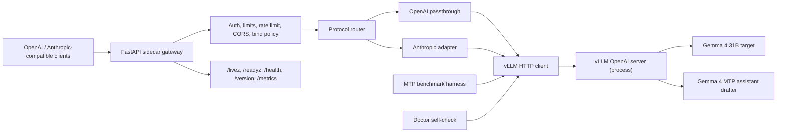

# Gemma 4 31B MTP vLLM Server

A production-minded FastAPI sidecar for serving Gemma 4 31B on vLLM with
Gemma 4 Multi-Token Prediction (MTP) speculative decoding. It keeps the raw
`vllm serve` process private and adds OpenAI-compatible and Anthropic-compatible
HTTP APIs, API-key auth, CORS controls, rate limiting, bounded admission,
health/readiness diagnostics, release hygiene checks, and Prometheus-style
gateway metrics.

The current release is an alpha for NVIDIA CUDA-backed local serving and
public-safe DGX Spark cluster planning. The published runtime benchmark evidence
comes from a 2x NVIDIA GeForce RTX 5090 host with vLLM `0.21.0`; the cluster
planner generalizes the launch plan to 2x and larger DGX Spark-style NVIDIA
systems without performing live execution.

## Current Status

The public `main` branch now includes the P2-001 DGX Spark dry-run planner for
2x and larger cluster topologies. This planner is intentionally non-executing:
it produces reviewed Ray/vLLM command plans, transport environment, hashes,
fingerprints, and live-gate expectations without opening SSH sessions, starting
Ray, starting vLLM, stopping services, or changing the default profile.

Cluster inventory is public-safe by default:

- checked-in topology examples use documentation-only addresses
- real hostnames and fabric IPs belong in gitignored `local` or `private`
  topology files
- RoCE-A plans require runtime-bound NCCL evidence and retain socket fallback
  as the safe transport path

## NVIDIA System Compatibility

This repository is not limited to the published 2x RTX 5090 benchmark host.
That host is the current real-hardware evidence source for the local serving
profile; it is not the only intended NVIDIA deployment shape.

Supported planning and serving surfaces:

- Single high-memory NVIDIA GPU: `safe80` targets an 80 GB-class CUDA device
  and remains marked `unverified` until hardware evidence is added.
- Multi-GPU NVIDIA workstation/server: `tp2`, `tp2_2x32_smoke`, and
  `tp2_2x32_fp8_gpuonly` cover tensor-parallel local vLLM launch shapes.
- DGX Spark-style multi-node NVIDIA cluster: `vllm-mtp cluster-plan` builds
  dry-run Ray/vLLM launch plans for 2, 4, 6, and 8 selected nodes.

DGX Spark assumptions in v1:

- Each selected node is modeled as one GPU by default.
- `tensor_parallel_size` resolves to the selected total GPU count.
- `socket` transport is the default fallback path and sets `NCCL_IB_DISABLE=1`.
- `roce-a` is explicit and emits runtime-bound NCCL environment/log settings.
- HCA, GID index, and dual-rail overrides are not guessed automatically.
- The planner does not SSH, start Ray, start vLLM, stop processes, or promote a
  transport profile.

Compatibility status:

- Local 2x RTX 5090 FP8/MTP serving has benchmark evidence.
- DGX Spark 2x+ cluster support is currently plan/evidence generation only.
- Live DGX Spark promotion requires generation smoke, queue drain, NCCL log
  evidence, Ray continuity, soak, rollback proof, and a healthy socket fallback.

The earlier P1-001R repair stream has corrected the benchmark methodology needed
to decide whether CUDA-graph hybrid can replace the current eager production
profile. The repo now includes:

- persistent benchmark transport and streaming token instrumentation
- automatic A/B/C/D 2x2 comparison for same-mode MTP correctness
- separated fixed-length throughput and natural-EOS quality lanes
- independent bootstrap confidence intervals for performance and MTP
  acceptance gates
- CUDA graph observation from vLLM metrics and sanitized startup logs
- pre-maintenance code gate, source archive, wheel, and bundle validation
- read-only live baseline evidence summary
- safe-shutdown preflight and rollback handoff for the maintenance window

Current production rollback profile remains:

- Profile: `tp2_2x32_fp8_gpuonly`
- Mode: eager, `enforce_eager=true`
- Backend: private GPU host loopback vLLM port
- Gateway: private GPU host loopback gateway port

The CUDA-graph candidate is `tp2_2x32_fp8_gpuonly_cuda_graph`, which preserves
the same runtime settings except `enforce_eager=false`. It is a candidate only:
it has not been adopted, it is not the default profile, and it must not be
presented as production-ready until the P1-001R maintenance run collects A/B/C/D
evidence, same-mode MTP correctness, natural-EOS quality results, graph
evidence, candidate soak, and rollback validation.

The next operational step is gated on one explicit maintenance authorization
covering live gateway stop, live backend stop, A/B/C/D one backend at a time,
candidate sanity soak, live eager backend restore, gateway restore, and
post-rollback validation. See
[`docs/plans/p1-001r-001-live-baseline.md`](docs/plans/p1-001r-001-live-baseline.md)
and
[`docs/plans/p1-001r-002-safe-shutdown-preflight.md`](docs/plans/p1-001r-002-safe-shutdown-preflight.md).

## Performance Snapshot

Benchmark ID: `local-fp8-gpuonly-vllm021-tp2-depth4-20260622-p0`

This is a local direct vLLM endpoint A/B result and not a universal Gemma 4 MTP performance claim.
It compares one MTP-enabled vLLM process against a separate no-MTP vLLM process
on the same local host. It is not a gateway-overhead test.

Scope:

- Hardware: 2x NVIDIA GeForce RTX 5090, 32 GB each
- `profile`: `tp2_2x32_fp8_gpuonly`
- `target`: `google/gemma-4-31B-it`
- `drafter`: `google/gemma-4-31B-it-assistant`
- `vllm`: `0.21.0`
- `torch`: `2.11.0+cu130`
- `tensor_parallel_size`: `2`
- `quantization`: `fp8`
- `cpu_offload_gb`: `0`
- `max_model_len`: `2048`
- `max_num_seqs`: `1`
- `max_num_batched_tokens`: `4096`
- `enforce_eager`: `true`
- `num_speculative_tokens`: `4`

Metric: `e2e_output_tokens_per_second`, which includes HTTP streaming,
queueing/prefill/TTFT, and decode time. Do not compare it to a raw engine-only
`generation_tps` metric.

| Output token target | No-MTP baseline | MTP enabled | Local speedup |
| --- | ---: | ---: | ---: |
| 64 | 13.83 tok/s | 47.79 tok/s | 3.46x |
| 256 | 13.88 tok/s | 54.02 tok/s | 3.89x |
| 512 | 13.78 tok/s | 55.03 tok/s | 3.99x |

The 1024-token MTP-only smoke was approximately 19.9 seconds, or about
51.5 output tok/s. Treat it as a long-request MTP smoke result, not an MTP vs
no-MTP speedup test unless a paired no-MTP baseline artefact is present.

See
[`docs/benchmarks/local-fp8-gpuonly-vllm021-tp2-depth4-20260622-p0.md`](docs/benchmarks/local-fp8-gpuonly-vllm021-tp2-depth4-20260622-p0.md)
for the immutable benchmark record and reproduction commands.

## Verified Results

### Real Hardware Smoke

Validated on `2026-05-17` with:

- Hardware: `2x NVIDIA GeForce RTX 5090`
- Backend: `vllm 0.21.0`, tensor parallel size `2`
- Served model alias: `gemma-4-31b-mtp`
- Gateway: `127.0.0.1:18080`, upstream vLLM on `127.0.0.1:8010`

Smoke results:

- `/health`: `ready`, `version_ok: true`, backend version `0.21.0`
- `/v1/models`: returned OpenAI model objects with `display_name`
- `/v1/chat/completions`: `200 OK`
- `/v1/chat/completions` streaming: `200 OK` and `[DONE]`
- `/v1/messages`: `200 OK`
- `/v1/messages/count_tokens`: `200 OK`
- `/metrics`: `gemma4_mtp_backend_errors 0`

This is the BF16 CPU-offload smoke result for `tp2_2x32_smoke`
(`cpu_offload_gb: 8`). It proves that the API surfaces and health checks work on
the constrained 2x RTX 5090 host. It is separate from the FP8 GPU-only result
above and should not be used as a throughput claim.

### MTP Throughput

The current public throughput result is the FP8 GPU-only result identified by
`local-fp8-gpuonly-vllm021-tp2-depth4-20260622-p0`. It is a direct vLLM
MTP vs no-MTP speedup test, not a gateway-overhead test. Older unscoped
throughput numbers have been removed from the README; keep any future numbers
behind an immutable benchmark ID and artefact bundle.

The MTP service was restored after the benchmark and left healthy.

## Architecture



## Profiles

The default `safe80` profile targets a single 80 GB-class GPU and is kept as
an unverified high-memory profile:

- Target: `google/gemma-4-31B-it`
- Drafter: `google/gemma-4-31B-it-assistant`
- `num_speculative_tokens`: `4`
- `tensor_parallel_size`: `1`
- `gpu_memory_utilization`: `0.90`
- `max_model_len`: `32768`
- `validation_level`: `unverified`

The `tp2` profile is the unverified 2x40GB+ 32K-context target. It is not the
constrained 2x32GB smoke configuration.

Use `tp2_2x32_smoke` to reproduce the constrained 2x RTX 5090 smoke backend:

- `tensor_parallel_size`: `2`
- `gpu_memory_utilization`: `0.95`
- `max_model_len`: `2048`
- `cpu_offload_gb`: `8`
- `max_num_seqs`: `1`
- `max_num_batched_tokens`: `4096`
- `enforce_eager`: `true`
- `max_output_tokens`: `1024`
- `validation_level`: `smoke`

Use `tp2_2x32_fp8_gpuonly` for the all-GPU FP8 experiment on the same host.
It sets `cpu_offload_gb: 0` and `quantization: fp8`.

Use `tp2_2x32_fp8_gpuonly_cuda_graph` only for isolated validation. It matches
`tp2_2x32_fp8_gpuonly` except that eager mode is disabled. Do not make it the
default or live profile until the P1-001R recommendation explicitly supports
adoption and a separate operator approval changes the default.

## DGX Spark Cluster Dry-Run Planning (v1)

`vllm-mtp cluster-plan` is the public-safe planner for 2x+ DGX Spark topologies.
It prints a complete, reproducible launch plan and evidence contract without
executing anything.

### Contract

- No live action is performed: no SSH, no `ray start`, no `ray stop`, no process
  kill, no service restart.
- Output is explicitly audit-ready and marked as `dry_run_only: true`.
- Planned command order is deterministic: `ray-head`, worker nodes, then
  `vllm-serve`.
- Topology validation is enforced before command generation.
- Supported transport profiles are `socket` and `roce-a`.

### Topology and public-safe files

Use checked-in examples for review and CI:

- `config/cluster_topologies.example.yaml`
- `src/gemma4_mtp_vllm/config/cluster_topologies.example.yaml`

Store real hosts, fabric IPs, and inventory in gitignored files:

- `config/cluster_topologies.local.yaml`
- `config/cluster_topologies.private.yaml`

### CLI flags

Common options:

- Topology: `--profile`, `--topology-file`, `--topology`, `--node-count`
  (`2|4|6|8`), `--transport-profile socket|roce-a`
- Runtime/transport: `--runtime-id`, `--head-ip`, `--fabric-iface`,
  `--fabric-cidr`, `--port`, `--ray-port`
- vLLM launch binding: `--vllm-bin`, `--venv`, `--model-path`,
  `--served-model-name`, `--max-model-len`, `--gpu-memory-utilization`,
  `--max-num-seqs`, `--max-num-batched-tokens`, `--no-mtp`
- Output: `--format shell|json`, `--json-output`

### v1 output expectations

`--format json` includes at least these top-level fields:

- `schema_version`
- `dry_run_only`
- `runtime_id`
- `profile`
- `topology`
- `node_count`
- `transport_profile`
- `commands`
- `resolved_environment_sha256`
- `resolved_command_sha256`
- `dry_run_fingerprint`
- `expected_live_gates`

`--format shell` emits shell-safe command strings for review.

### RoCE-A policy in v1

`socket` adds `NCCL_IB_DISABLE=1`.

`roce-a` keeps explicit transport tuning in-plan with runtime-scoped log paths
(`NCCL_DEBUG_FILE` under `runtime_id`) and does not auto-add HCA/gid dual-rail
overrides.

No RoCE-A benchmark is considered a full promotion on its own. Evidence still
requires generation smoke, queue drain, runtime-bound NCCL log proof, Ray
continuity, soak, rollback behavior, and a healthy socket fallback.

`/v1/models` is intentionally not treated as sufficient health for RoCE-A in
this phase.

## vLLM Requirement

The gateway pins the GPU extra to `vllm == 0.21.0` for Gemma 4 MTP. vLLM
0.21.0 ships official Gemma 4 MTP speculative decoding support via PR #41745.
Older vLLM releases can fail during initialization or treat the Gemma 4
assistant checkpoint incorrectly. This matters because older releases can
mishandle the assistant checkpoint.

vLLM is an **optional extra** because it pulls heavy CUDA / ROCm wheels.
Install it separately on the GPU host with:

```bash
pip install -c constraints/vllm-0.21.0-cu130.txt -e ".[dev,vllm]"
```

The constraint file also pins the FastAPI/instrumentator stack used by vLLM's
HTTP server so a fresh virtual environment does not depend on mutable
`site-packages` patches.

The gateway process itself does not import `vllm`; it only talks to a
running `vllm serve` over HTTP.

## Quick Start

### Prerequisites

- Python `3.10+`. Python `3.12` recommended.
- NVIDIA CUDA driver `12.x` for the primary serving path. CUDA 12.9 wheels are
  supported through the pinned vLLM constraint stack. AMD ROCm `7.2.1+` may be
  used for compatible vLLM environments, but DGX Spark planning is NVIDIA/Ray/NCCL
  oriented.
- The gateway itself does not require a GPU. `vllm serve` requires compatible
  accelerator hardware. `vllm-mtp cluster-plan` can run on a non-GPU workstation
  because it only produces dry-run plans.
- Enough VRAM for the chosen profile (`safe80` needs 80 GB, unverified `tp2`
  targets 2× 40+ GB, `tp2_2x32_smoke` targets 2× 32 GB with CPU offload).

### 1. Clone the repository

```bash
git clone https://github.com/alicankiraz1/Gemma-4-31B-MTP-vLLM-Server.git
cd Gemma-4-31B-MTP-vLLM-Server
```

### 2. Create and activate a virtual environment

```bash
python3.12 -m venv .venv
source .venv/bin/activate
python -m pip install --upgrade pip
```

### 3. Install the gateway

For local development (gateway + tests, without vLLM):

```bash
python -m pip install -e ".[dev]"
```

For a GPU host that will also run `vllm serve`:

```bash
python -m pip install -c constraints/vllm-0.21.0-cu130.txt -e ".[dev,vllm]"
```

The `[vllm]` extra pins `vllm == 0.21.0` plus the compatible FastAPI and
instrumentator versions. On NVIDIA hosts that need the latest pre-release CUDA
wheels, test them in a separate environment before replacing the pinned stack:

```bash
uv pip install -U vllm --pre \
    --extra-index-url https://wheels.vllm.ai/nightly/cu129 \
    --extra-index-url https://download.pytorch.org/whl/cu129 \
    --index-strategy unsafe-best-match
```

### 4. Start vLLM

```bash
vllm-mtp launch --profile safe80 --host 127.0.0.1 --port 8000
```

This prints and executes the canonical `vllm serve` command for the chosen
profile, including `--speculative-config` with the Gemma 4 MTP drafter. Use
`--print-only` first to inspect the exact command:

```bash
vllm-mtp launch --profile safe80 --print-only
```

Non-`--print-only` launches write a runtime manifest before replacing the
process with `vllm serve`. The default path is
`logs/vllm-launch-manifest.json`; it includes a redacted argv, PID, git SHA,
package versions, selected profile, served model name, and timestamp.

For the constrained 2x RTX 5090 smoke profile:

```bash
vllm-mtp launch --profile tp2_2x32_smoke --host 127.0.0.1 --port 8000 --print-only
```

For raw vLLM exposure, keep `--host 127.0.0.1`. Passing a non-loopback host to
`vllm-mtp launch` requires `--allow-public-vllm` because raw vLLM has no gateway
auth, rate limiting, or CORS protection.

### 5. DGX Spark cluster dry-run planning

`vllm-mtp cluster-plan` generates a public-safe dry-run launch plan for 2x and
larger DGX Spark NVIDIA clusters. See
[DGX Spark Cluster Dry-Run Planning (v1)](#dgx-spark-cluster-dry-run-planning-v1)
for full behavior, flags, and evidence fields.

It does not start Ray, start vLLM, stop services, open SSH sessions, or change
any default profile.

The checked-in example topology uses documentation-only addresses. Put real
cluster inventory in an ignored private topology file such as
`config/cluster_topologies.private.yaml`:

```bash
vllm-mtp cluster-plan \
    --profile tp2_2x32_fp8_gpuonly \
    --topology-file config/cluster_topologies.private.yaml \
    --topology dgx-spark-private \
    --node-count 4 \
    --runtime-id my-runtime-id \
    --json-output artifacts/cluster-runs/my-runtime-id/plan.json \
    --transport-profile socket \
    --format shell
```

Use JSON output when you want captured plan evidence:

```bash
vllm-mtp cluster-plan \
    --profile tp2_2x32_fp8_gpuonly \
    --topology-file config/cluster_topologies.private.yaml \
    --topology dgx-spark-private \
    --node-count 4 \
    --runtime-id my-runtime-id \
    --transport-profile socket \
    --format json \
    --json-output artifacts/cluster-runs/my-runtime-id/plan.json
```

For a RoCE-A trial, keep the plan explicit and runtime-bound:

```bash
vllm-mtp cluster-plan \
    --profile tp2_2x32_fp8_gpuonly \
    --topology-file config/cluster_topologies.private.yaml \
    --topology dgx-spark-private \
    --node-count 4 \
    --runtime-id my-roce-runtime-id \
    --transport-profile roce-a \
    --fabric-iface fabric0 \
    --fabric-cidr 198.51.100.0/24 \
    --json-output artifacts/cluster-runs/my-roce-runtime-id/plan.json \
    --format json
```

`--format json` outputs the contract fields listed in the section above and includes
`dry_run_only: true`, command/environment SHA-256 values, the dry-run
fingerprint, and expected live gates.

Example JSON shape:

```json
{
  "schema_version": "1.0",
  "dry_run_only": true,
  "runtime_id": "my-runtime-id",
  "profile": "tp2_2x32_fp8_gpuonly",
  "topology": "dgx-spark-private",
  "node_count": 4,
  "transport_profile": "socket",
  "commands": [
    {"type": "ray-head", "host": "host-1", "shell": "..."},
    {"type": "ray-worker", "host": "host-2", "shell": "..."},
    {"type": "vllm-serve", "host": "host-1", "shell": "..."}
  ],
  "resolved_environment_sha256": "...",
  "resolved_command_sha256": "...",
  "dry_run_fingerprint": "...",
  "expected_live_gates": ["generation_smoke", "queue_drain", "ray_continuity"]
}
```

For RoCE-A, the same gating still applies: generation smoke, queue drain,
runtime-bound NCCL log proof, Ray continuity, soak, rollback evidence, and a
preserved socket fallback remain required. `/v1/models` liveness alone is not
RoCE health.

### 6. Start the gateway

```bash
vllm-mtp serve \
    --profile safe80 \
    --host 127.0.0.1 \
    --port 8080 \
    --api-key local-dev-key \
    --vllm-base-url http://127.0.0.1:8000
```

The gateway binds to `127.0.0.1` by default. Binding the gateway to `0.0.0.0`
requires an `--api-key`.

## Doctor

Verify the vLLM process is reachable, new enough for Gemma 4 MTP, and serving
the configured target model:

```bash
vllm-mtp doctor --profile tp2_2x32_smoke --vllm-base-url http://127.0.0.1:8000
```

Expected output shape (single-line JSON):

```json
{"ok": true, "profile": "tp2_2x32_smoke", "target_model": "google/gemma-4-31B-it", "served_model_name": "gemma-4-31b-mtp", "drafter": "google/gemma-4-31B-it-assistant", "drafter_configured": "google/gemma-4-31B-it-assistant", "drafter_loaded": "unknown", "num_speculative_tokens": 4, "tensor_parallel_size": 2, "gateway_version": "0.2.0a1", "required_vllm_min_version": "0.21.0", "vllm": {"status": "ok", "version": "0.21.0"}, "version_ok": true, "target_served": true, "desired_config": {"max_model_len": 2048}, "observed_config": {"max_model_len": 2048, "target_served": true}, "config_verification": {"status": "partial", "fields": {"max_model_len": {"status": "verified", "source": "vllm_models_api"}, "cpu_offload_gb": {"status": "unknown", "source": "unknown"}}}, "config_matches": false, "mtp": {"state": "active", "metrics_registered": true, "active_since_start": true, "drafted_tokens_total": 960.0, "accepted_tokens_total": 863.0, "acceptance_rate": 0.899}, "mtp_observed": true}
```

`ok: false` indicates vLLM is unreachable, older than the required version, or
the target model is not listed in vLLM's `/v1/models`. Real vLLM reports the
served target model there; the drafter is reported as configured by this
gateway and `drafter_loaded` remains `unknown`. `config_verification` reports
field-level `verified`, `mismatch`, `unknown`, or `not_applicable` statuses.
`config_matches` is true only when all required runtime fields are verified;
connectivity alone does not prove the backend was launched with the selected
profile or MTP path.
`mtp_observed` is derived from parsed vLLM speculative decoding counters, not
from metric names alone. Benchmark artefacts include before/after metric
snapshots and deltas; treat those deltas as endpoint-local evidence for the run
window, not proof that no concurrent traffic contributed to process counters.

## Benchmarks

The bench harness compares one vLLM process running with MTP enabled
against a second vLLM process running without `--speculative-config`. This is
the MTP vs no-MTP speedup test. A direct-vLLM vs gateway-overhead test is a
different experiment: keep MTP/no-MTP fixed and compare direct vLLM requests to
requests routed through the gateway. The user is responsible for launching both
processes before running a speedup benchmark.

Example FP8 GPU-only reproduction for
`local-fp8-gpuonly-vllm021-tp2-depth4-20260622-p0`:
Use the immutable artefact flag
`--artifact-id local-fp8-gpuonly-vllm021-tp2-depth4-20260622-p0` when
sharing generated benchmark evidence.

Terminal 1 (MTP-enabled vLLM on 8001):

```bash
vllm-mtp launch --profile tp2_2x32_fp8_gpuonly --port 8001
```

Terminal 2 (baseline vLLM without MTP on 8002):

```bash
vllm-mtp launch --profile tp2_2x32_fp8_gpuonly --port 8002 --no-mtp
```

Terminal 3 (paired bench):

```bash
vllm-mtp bench \
    --prompt "Summarize the key trade-offs of running Gemma 4 locally." \
    --profile tp2_2x32_fp8_gpuonly \
    --output-token-target 256 \
    --mtp-url http://127.0.0.1:8001 \
    --baseline-url http://127.0.0.1:8002 \
    --runs 10 \
    --warmup-runs 2 \
    --artifact-root artifacts/benchmarks \
    --artifact-id local-fp8-gpuonly-vllm021-tp2-depth4-20260622-p0 \
    --json-output bench-results/local-fp8-gpuonly-vllm021-tp2-depth4-20260622-p0.json
```

To reproduce all published output-token targets in one matrix:

```bash
vllm-mtp bench-matrix \
    --profile tp2_2x32_fp8_gpuonly \
    --baseline-url http://127.0.0.1:8002 \
    --mtp-url http://127.0.0.1:8001 \
    --prompt "Summarize the key trade-offs of running Gemma 4 locally." \
    --num-speculative-tokens 4 \
    --output-token-target 64 \
    --output-token-target 256 \
    --output-token-target 512 \
    --runs 10 \
    --warmup-runs 2 \
    --json-output bench-results/local-fp8-gpuonly-vllm021-tp2-depth4-20260622-p0-matrix.json
```

For a matrix sweep over multiple prompts and `num_speculative_tokens`
values, launch one MTP-enabled vLLM endpoint per speculative depth. A single
live vLLM endpoint cannot change `num_speculative_tokens` per request.

```bash
vllm-mtp bench-matrix \
    --profile tp2_2x32_fp8_gpuonly \
    --baseline-url http://127.0.0.1:8002 \
    --prompt "Short technical answer." \
    --prompt "Long multi-step reasoning." \
    --num-speculative-tokens 2 \
    --num-speculative-tokens 4 \
    --depth-mtp-url 2=http://127.0.0.1:8001 \
    --depth-mtp-url 4=http://127.0.0.1:8003 \
    --runs 10 \
    --warmup-runs 2 \
    --json-output bench-results/local-depth-sweep.json
```

### Upstream caveat

vLLM has reported very low draft acceptance rates (~0.2%) for Gemma 4 31B
MTP in some setups. The bench harness measures this directly through
`e2e_output_tokens_per_second` comparisons and MTP metric deltas. If your
median speedup is close to `1.0` even with MTP enabled, you are likely hitting
that upstream regression.
See https://github.com/vllm-project/vllm/issues/41789 for the active
discussion.

### P1-001R CUDA Graph Decision Run

The current CUDA-graph decision path uses four sequential single-backend runs:

| ID | Profile | MTP | Eager |
| --- | --- | --- | --- |
| A | `tp2_2x32_fp8_gpuonly` | disabled | true |
| B | `tp2_2x32_fp8_gpuonly` | enabled | true |
| C | `tp2_2x32_fp8_gpuonly_cuda_graph` | disabled | false |
| D | `tp2_2x32_fp8_gpuonly_cuda_graph` | enabled | false |

Run `bench-2x2-compare` over the four `bench-single` JSON files to separate
same-execution-mode MTP correctness gates from cross-mode eager-vs-graph
diagnostics:

```bash
vllm-mtp bench-2x2-compare \
    --a-json "$EVIDENCE/matrix/A/eager_no_mtp.json" \
    --b-json "$EVIDENCE/matrix/B/eager_mtp.json" \
    --c-json "$EVIDENCE/matrix/C/graph_no_mtp.json" \
    --d-json "$EVIDENCE/matrix/D/graph_mtp.json" \
    --json-output "$EVIDENCE/compare/p1-001r-2x2.json"
```

Cross-mode B-vs-D token inequality is diagnostic only. It must not be classified
as an MTP correctness failure unless same-mode A-vs-B or C-vs-D fails.

## API Examples

### OpenAI-compatible chat

```bash
curl -sS http://127.0.0.1:8080/v1/chat/completions \
    -H "Authorization: Bearer local-dev-key" \
    -H "Content-Type: application/json" \
    -d '{
        "model": "gemma-4-31b-mtp",
        "messages": [
            {"role": "system", "content": "Kisa ve net cevap ver."},
            {"role": "user", "content": "Merhaba, calisiyor musun?"}
        ],
        "max_tokens": 32,
        "temperature": 0
    }' | python3 -m json.tool
```

### Anthropic-compatible messages

```bash
curl -sS http://127.0.0.1:8080/v1/messages \
    -H "Authorization: Bearer local-dev-key" \
    -H "Content-Type: application/json" \
    -d '{
        "model": "claude-gemma-4-31b-mtp",
        "max_tokens": 32,
        "system": "Kisa ve net cevap ver.",
        "messages": [
            {"role": "user", "content": "Merhaba, calisiyor musun?"}
        ]
    }' | python3 -m json.tool
```

## Alpha Policy

The gateway remains intentionally narrow in the 0.2 alpha. The following request fields
fail fast with `400 unsupported_feature` instead of being silently ignored
or forwarded to vLLM:

- OpenAI: `tools`, `tool_choice`, `function_call`, `functions`, `stop`,
  and structured `response_format` while MTP is enabled.
- Anthropic: `tools`, `tool_choice`, `thinking`, `mcp`, `files`,
  `stop_sequences`.

No-op client defaults are accepted for compatibility:
`tools: []`, `tool_choice: "none"`, `function_call: "none"`,
`functions: []`, `stop: null`, `response_format: {"type": "text"}`,
Anthropic `tools: []`, `tool_choice: {"type": "none"}`,
`thinking: {"type": "disabled"}`, `stop_sequences: []`.

`/v1/messages/count_tokens` calls the upstream vLLM `/tokenize` endpoint with
the translated chat messages and returns the `backend_tokenizer` count in the
`X-Gemma4-MTP-Token-Counting` header.

Streaming SSE works through the gateway; vLLM streams natively. Anthropic
streaming buffers the upstream chunks before translation in the 0.2 alpha. Streaming
requests update the same generation token and generation second counters as
non-streaming requests.

## Guardrails

- `GET /livez` is public and returns `{"status":"ok"}`.
- `/health`, `/readyz`, `/version`, `/metrics` are protected when
  `--api-key` is configured.
- Request bodies are capped by `--max-body-mb` (default `2`).
- Output is capped by `--max-output-tokens` (default `4096`).
- In-memory rate limiting defaults to `--rate-limit-rpm 30` per credential
  (or per client host when no API key is configured).
- Gateway slot admits `--max-queue-size + 1` concurrent requests before
  rejecting; real concurrency is handled by vLLM's continuous batcher.
- CORS is default-deny; add `--cors-origin` for explicit browser clients.
- Non-loopback bind hosts require an `--api-key`.
- Keep raw `vllm serve` bound to `127.0.0.1` unless you explicitly accept that
  it has no gateway auth, rate limit, or CORS protection. Expose only the gateway
  for normal use.

## Release Hygiene

### Source Archives

Release archives must come from this script or from CI. Do not publish manually created Finder or desktop zip files.
Do not share a manually zipped working directory.
Release artifact scripts refuse a dirty worktree by default. Use `--allow-dirty`
only for local wheel smoke checks; never publish artifacts created from a dirty
workspace.

```bash
scripts/make_source_archive.sh
```

Use an explicit output path when needed:

```bash
scripts/make_source_archive.sh dist/Gemma-4-31B-MTP-vllm-src.zip
```

Verify that an archive does not contain local workspace, cache, build, or
macOS metadata entries:

```bash
scripts/verify_source_archive.sh Gemma-4-31B-MTP-vllm-src.zip
```

The verifier rejects `.git`, `.venv`, `.worktrees`, `dist`, build/cache entries
(`build`, `__pycache__`, `.pytest_cache`), `artifacts`, `logs`, env files,
internal/superpowers plan files, macOS metadata (`__MACOSX`, `.DS_Store`),
local absolute paths, and secret-like content.

### Wheel Freshness

Before publishing or sharing a wheel, rebuild it from the current checkout
and smoke-test the installed artifact:

```bash
scripts/verify_wheel_freshness.sh
```

The verifier removes stale wheels, builds a fresh one, installs it into a
temporary virtual environment, asserts the installed package reports
`0.2.0a1`, and exercises `/livez`, `/health` (with api key), and basic endpoint
shape using a fake vLLM transport.

## Verification

```bash
python -m pytest -q
python -m pip check
python -m compileall -q src
python -m build --wheel
```

### Local Verification (2026-05-17)

- `python -m pytest -q` -> `218 passed`
- `python -m pip check` → `No broken requirements found.`
- `python -m compileall -q src` → no errors
- `python -m build --wheel` → built `gemma4_mtp_vllm-0.2.0a1-py3-none-any.whl`
- `scripts/verify_wheel_freshness.sh` → `wheel smoke ok`
- `scripts/make_source_archive.sh` + `scripts/verify_source_archive.sh` → archive clean

218 tests cover profiles, server limits, bind policy, errors, runtime state,
middleware, policy validation, request validation, vLLM HTTP client, Anthropic
adapter, server app foundation, health, metrics, OpenAI endpoints, Anthropic
endpoints, doctor, benchmarking, launch helper, CLI, bench CLI, versioning, and
release scripts.

### P0-004 Local Verification (2026-06-22)

- `python -m pytest -q` -> `243 passed`
- `python -m pip check` → `No broken requirements found.`
- `python -m compileall -q src` → no errors
- `git diff --check` → no errors
- secret and local-path scan → clean

243 tests cover the prior release surface plus readiness state-machine behavior,
MTP per-generation delta evidence, and streaming slot lifecycle regressions.

### P1-001R Code Gate Verification (2026-06-25)

- `.venv/bin/python -m pytest -q` -> `374 passed, 144 warnings`
- `.venv/bin/python -m compileall -q src tests` -> no errors
- `.venv/bin/python -m pip check` -> `No broken requirements found.`
- `git diff --check` -> no errors
- wheel freshness smoke -> built and installed
  `gemma4_mtp_vllm-0.2.0a1-py3-none-any.whl`
- source archive verification -> clean
- git bundle verification -> clean

374 tests cover the prior release surface plus P0-001 evidence audit, persistent
benchmark transport, corrected streaming token instrumentation, automatic 2x2
comparison, throughput and quality lanes, statistical recommendation gates,
CUDA graph observation, runtime attestation, and release artifact checks.

### P2-001 Cluster Planner Verification (2026-06-25)

- `.venv/bin/python -m pytest tests/test_cluster.py tests/test_cli.py::test_cluster_plan_command_prints_shell_safe_dry_run tests/test_cli.py::test_cluster_plan_command_prints_deterministic_json tests/test_cli.py::test_cluster_plan_rejects_invalid_inputs tests/test_release_scripts.py::test_gitignore_covers_private_cluster_topologies tests/test_release_scripts.py::test_public_cluster_topology_example_has_no_private_addresses -q` -> `12 passed`
- `.venv/bin/python -m pytest tests/test_cluster.py tests/test_profiles.py tests/test_launch.py tests/test_cli.py tests/test_release_scripts.py -q` -> `65 passed`
- `.venv/bin/python -m pytest -q` -> `386 passed, 144 warnings`
- `.venv/bin/python -m compileall -q src tests` -> no errors
- `.venv/bin/python -m pip check` -> `No broken requirements found.`
- `git diff --check` -> no errors

386 tests cover the prior release surface plus DGX Spark dry-run planning,
socket/RoCE-A transport environment generation, private topology hygiene,
deterministic shell/JSON output, dry-run fingerprints, and CLI rejection paths
for invalid cluster inputs.

## Operational Notes

- The external model aliases are `gemma-4-31b-mtp`, `claude-gemma-4-31b-mtp`,
  and `default`.
- Gateway requests are routed upstream using the configured served vLLM model
  name, so vLLM can be launched with `--served-model-name gemma-4-31b-mtp`.
- `/health` and `/readyz` are version-aware and report degraded status when the
  upstream vLLM version is older than `0.21.0`.
- The gateway intentionally rejects unsupported tool, multimodal, and advanced
  stop/format fields instead of silently dropping them.

## Author

**Alican Kiraz**

[](https://linkedin.com/in/alican-kiraz)
[](https://x.com/AlicanKiraz0)
[](https://alican-kiraz1.medium.com)
[](https://huggingface.co/AlicanKiraz0)
[](https://github.com/alicankiraz1)
