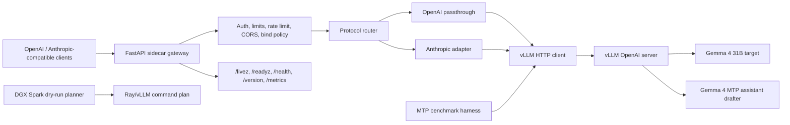

# Gemma 4 31B MTP vLLM Server

FastAPI sidecar and launch tooling for serving `google/gemma-4-31B-it` on
vLLM with Gemma 4 Multi-Token Prediction (MTP) speculative decoding.

The repository has three practical surfaces:

- A local API gateway that exposes OpenAI-compatible and Anthropic-compatible
  endpoints in front of a private `vllm serve` process.
- NVIDIA CUDA launch profiles for single-GPU and tensor-parallel local serving.
- Public-safe DGX Spark cluster planning and explicit live serve execution for
  2x and larger NVIDIA clusters.

The current release is an alpha. The published runtime benchmark evidence comes
from a 2x NVIDIA GeForce RTX 5090 host with vLLM `0.21.0`. DGX Spark support
has two separate paths: `cluster-plan` remains dry-run-only for review, while
`cluster-serve` can start a live Ray/vLLM MTP serve flow over SSH when a private
topology and `--confirm-live` are provided.

## What This Provides

- `vllm-mtp launch`: prints or executes the canonical `vllm serve` command for
  a selected Gemma 4 MTP profile.
- `vllm-mtp serve`: starts the FastAPI gateway with auth, CORS controls, body
  limits, rate limiting, bounded admission, readiness, and metrics.
- `vllm-mtp doctor`: verifies vLLM reachability, version compatibility, served
  model identity, runtime config evidence, and MTP metric observation.
- `vllm-mtp bench`, `bench-matrix`, `bench-single`, and `bench-2x2-compare`:
  benchmark MTP/no-MTP behavior and CUDA graph decision candidates with
  reproducible JSON artifacts.
- `vllm-mtp cluster-plan`: builds deterministic dry-run Ray/vLLM launch plans
  for DGX Spark-style clusters.
- `vllm-mtp cluster-serve`: starts the planned Ray head, Ray workers, and MTP
  vLLM serve process for private DGX Spark topology files after explicit
  operator confirmation, SSH preflight, and post-start gates.

## Current Compatibility

| Surface | Status | Notes |
| --- | --- | --- |
| Gateway-only development | Supported | No GPU required; install with `.[dev]`. |
| Single 80 GB-class NVIDIA GPU | Profile available | `safe80`; marked `unverified` until hardware evidence is added. |
| 2x NVIDIA local tensor parallel | Smoke/benchmark evidence | `tp2_2x32_smoke` and `tp2_2x32_fp8_gpuonly` have RTX 5090 evidence. |
| DGX Spark 2x+ cluster | Plan and explicit live serve | Plans or starts 2, 4, 6, and 8 selected nodes. |
| RoCE-A transport | Explicit plan/live option | Requires live operator gates before promotion; socket remains fallback. |

The project is not limited to the 2x RTX 5090 benchmark host. That machine is
the current real-hardware evidence source for local serving, while the planner
generalizes Ray/vLLM command generation to DGX Spark-style NVIDIA clusters.

## Quick Start

### 1. Clone and create a virtual environment

```bash
git clone https://github.com/alicankiraz1/Gemma-4-31B-MTP-vLLM-Server.git
cd Gemma-4-31B-MTP-vLLM-Server

python3.12 -m venv .venv
source .venv/bin/activate
python -m pip install --upgrade pip
```

Python `3.10+` is supported. Python `3.12` is recommended.

### 2. Install the package

For gateway development and tests without vLLM:

```bash
python -m pip install -e ".[dev]"
```

For a GPU host that will also run `vllm serve`:

```bash
python -m pip install -c constraints/vllm-0.21.0-cu130.txt -e ".[dev,vllm]"
```

The `[vllm]` extra pins `vllm == 0.21.0` plus compatible FastAPI and
`prometheus-fastapi-instrumentator` versions. The gateway itself does not import
vLLM; it talks to a running vLLM OpenAI-compatible HTTP server.
The constraint file keeps the vLLM HTTP stack independent from mutable
`site-packages` patches in an existing environment.

### 3. Choose a profile

| Profile | Intended use | Evidence level |
| --- | --- | --- |
| `safe80` | Single 80 GB-class CUDA device, 32K context | `unverified` |
| `tp2` | 2x40 GB+ tensor parallel, 32K context | `unverified` |
| `tp2_2x32_smoke` | 2x32 GB smoke with BF16 CPU offload | `smoke` |
| `tp2_2x32_fp8_gpuonly` | 2x32 GB all-GPU FP8 serving | `smoke`, published benchmark |
| `tp2_2x32_fp8_gpuonly_cuda_graph` | CUDA graph candidate validation only | `smoke`, not default |

The external model aliases are:

- `gemma-4-31b-mtp`
- `claude-gemma-4-31b-mtp`
- `default`

### 4. Inspect or start vLLM

Inspect the exact command first:

```bash
vllm-mtp launch --profile safe80 --print-only
```

Start vLLM on loopback:

```bash
vllm-mtp launch --profile safe80 --host 127.0.0.1 --port 8000
```

For the constrained 2x32 GB smoke profile:

```bash
vllm-mtp launch --profile tp2_2x32_smoke --host 127.0.0.1 --port 8000 --print-only
```

For the FP8 GPU-only profile used by the published local benchmark:

```bash
vllm-mtp launch --profile tp2_2x32_fp8_gpuonly --host 127.0.0.1 --port 8000 --print-only
```

Keep raw vLLM bound to `127.0.0.1` unless you explicitly accept that raw vLLM has
no gateway auth, rate limiting, or CORS protection. Passing a non-loopback host
to `vllm-mtp launch` requires `--allow-public-vllm`.

Non-`--print-only` launches write `logs/vllm-launch-manifest.json` before
replacing the process with `vllm serve`. The manifest includes a redacted argv,
PID, git SHA, package versions, selected profile, served model name, and
timestamp.

### 5. Verify the vLLM runtime

```bash
vllm-mtp doctor --profile tp2_2x32_smoke --vllm-base-url http://127.0.0.1:8000
```

`ok: true` means vLLM is reachable, new enough for Gemma 4 MTP, and serving the
configured target model. `config_matches: true` only appears when required
runtime fields are verified; connectivity alone is not treated as proof that the
backend was launched with the selected profile.

Expected output shape, abbreviated to the fields operators should check:

```json
{"ok": true, "profile": "tp2_2x32_smoke", "target_model": "google/gemma-4-31B-it", "served_model_name": "gemma-4-31b-mtp", "drafter": "google/gemma-4-31B-it-assistant", "drafter_configured": "google/gemma-4-31B-it-assistant", "drafter_loaded": "unknown", "num_speculative_tokens": 4, "tensor_parallel_size": 2, "gateway_version": "0.2.0a1", "required_vllm_min_version": "0.21.0", "vllm": {"status": "ok", "version": "0.21.0"}, "version_ok": true, "target_served": true, "desired_config": {"max_model_len": 2048}, "observed_config": {"max_model_len": 2048, "target_served": true}, "config_verification": {"status": "partial", "fields": {"max_model_len": {"status": "verified", "source": "vllm_models_api"}, "cpu_offload_gb": {"status": "unknown", "source": "unknown"}}}, "config_matches": false, "mtp": {"state": "active", "metrics_registered": true, "active_since_start": true, "drafted_tokens_total": 960.0, "accepted_tokens_total": 863.0, "acceptance_rate": 0.899}, "mtp_observed": true}
```

### 6. Start the gateway

```bash
vllm-mtp serve \
    --profile safe80 \
    --host 127.0.0.1 \
    --port 8080 \
    --api-key local-dev-key \
    --vllm-base-url http://127.0.0.1:8000
```

The gateway binds to `127.0.0.1` by default. Binding the gateway to `0.0.0.0`
requires `--api-key`.

### 7. Smoke test the API

OpenAI-compatible chat:

```bash
curl -sS http://127.0.0.1:8080/v1/chat/completions \
    -H "Authorization: Bearer local-dev-key" \
    -H "Content-Type: application/json" \
    -d '{
        "model": "gemma-4-31b-mtp",
        "messages": [
            {"role": "system", "content": "Kisa ve net cevap ver."},
            {"role": "user", "content": "Merhaba, calisiyor musun?"}
        ],
        "max_tokens": 32,
        "temperature": 0
    }' | python3 -m json.tool
```

Anthropic-compatible messages:

```bash
curl -sS http://127.0.0.1:8080/v1/messages \
    -H "Authorization: Bearer local-dev-key" \
    -H "Content-Type: application/json" \
    -d '{
        "model": "claude-gemma-4-31b-mtp",
        "max_tokens": 32,
        "system": "Kisa ve net cevap ver.",
        "messages": [
            {"role": "user", "content": "Merhaba, calisiyor musun?"}
        ]
    }' | python3 -m json.tool
```

## DGX Spark Cluster Dry-Run Planning

`vllm-mtp cluster-plan` creates a reproducible Ray/vLLM launch plan for 2x and
larger DGX Spark-style NVIDIA clusters. It is intentionally dry-run-only.

### v1 contract

- No `--execute` flag exists.
- No SSH command is generated.
- No `ray stop`, process kill, service stop, or restart command is generated.
- Command order is deterministic: `ray-head`, `ray-worker...`, then
  `vllm-serve`.
- The first selected node is the Ray head.
- `node_count` must be at least `2`.
- Each selected node must define `fabric_ip` and a positive GPU count.
- DGX Spark topology defaults to `gpus_per_node: 1`.
- `tensor_parallel_size` resolves to the selected total GPU count.

### Topology files

Checked-in examples use documentation-only addresses:

- `config/cluster_topologies.example.yaml`
- `src/gemma4_mtp_vllm/config/cluster_topologies.example.yaml`

Put real hostnames and fabric IPs in ignored private files:

- `config/cluster_topologies.local.yaml`
- `config/cluster_topologies.private.yaml`

Example private topology shape:

```yaml
topologies:
  dgx-spark-private:
    label: Private DGX Spark topology
    gpus_per_node: 1
    nodes:
      - name: spark-01
        fabric_ip: 198.51.100.1
      - name: spark-02
        fabric_ip: 198.51.100.2
```

Use real inventory only in private files. Do not commit private hostnames,
fabric IPs, tokens, runtime logs, or machine-local paths.

### Socket dry-run plan

```bash
vllm-mtp cluster-plan \
    --profile tp2_2x32_fp8_gpuonly \
    --topology-file config/cluster_topologies.private.yaml \
    --topology dgx-spark-private \
    --node-count 4 \
    --runtime-id my-runtime-id \
    --transport-profile socket \
    --format shell
```

Use JSON when you want captured plan evidence:

```bash
vllm-mtp cluster-plan \
    --profile tp2_2x32_fp8_gpuonly \
    --topology-file config/cluster_topologies.private.yaml \
    --topology dgx-spark-private \
    --node-count 4 \
    --runtime-id my-runtime-id \
    --transport-profile socket \
    --format json \
    --json-output artifacts/cluster-runs/my-runtime-id/plan.json
```

### RoCE-A dry-run plan

RoCE-A is explicit and runtime-bound:

```bash
vllm-mtp cluster-plan \
    --profile tp2_2x32_fp8_gpuonly \
    --topology-file config/cluster_topologies.private.yaml \
    --topology dgx-spark-private \
    --node-count 4 \
    --runtime-id my-roce-runtime-id \
    --transport-profile roce-a \
    --fabric-iface fabric0 \
    --fabric-cidr 198.51.100.0/24 \
    --format json \
    --json-output artifacts/cluster-runs/my-roce-runtime-id/plan.json
```

Transport behavior:

- `socket` sets `NCCL_IB_DISABLE=1`.
- `roce-a` sets `NCCL_IB_DISABLE=0`, `NCCL_IB_ADDR_FAMILY=AF_INET`,
  `NCCL_IB_ADDR_RANGE`, `NCCL_IB_ROCE_VERSION_NUM=2`, `NCCL_DEBUG=INFO`,
  `NCCL_DEBUG_SUBSYS=INIT,NET,COLL,PROXY`, `GEMMA4_MTP_RUNTIME_ID`, and a
  runtime-scoped `NCCL_DEBUG_FILE`.
- Environment values are deduplicated by key.
- `NCCL_IB_HCA`, `NCCL_IB_GID_INDEX`, and `NCCL_IB_MERGE_NICS` are not guessed
  automatically.

### JSON evidence shape

`--format json` includes:

- `schema_version`
- `dry_run_only`
- `runtime_id`
- `profile`
- `topology`
- `node_count`
- `tensor_parallel_size`
- `transport_profile`
- `commands`
- `environment`
- `resolved_environment_sha256`
- `resolved_command_sha256`
- `dry_run_fingerprint`
- `expected_live_gates`

Example shape:

```json
{
  "schema_version": 1,
  "dry_run_only": true,
  "runtime_id": "my-runtime-id",
  "profile": "tp2_2x32_fp8_gpuonly",
  "topology": {
    "id": "dgx-spark-private",
    "label": "Private DGX Spark topology",
    "head": "spark-01",
    "nodes": [
      {"name": "spark-01", "fabric_ip": "198.51.100.1", "gpus": 1},
      {"name": "spark-02", "fabric_ip": "198.51.100.2", "gpus": 1},
      {"name": "spark-03", "fabric_ip": "198.51.100.3", "gpus": 1},
      {"name": "spark-04", "fabric_ip": "198.51.100.4", "gpus": 1}
    ]
  },
  "node_count": 4,
  "tensor_parallel_size": 4,
  "transport_profile": "socket",
  "commands": [
    {"target": "spark-01", "role": "ray-head", "rank": 0, "command": "..."},
    {"target": "spark-02", "role": "ray-worker", "rank": 1, "command": "..."},
    {"target": "spark-01", "role": "vllm-serve", "rank": 0, "command": "..."}
  ],
  "environment": [
    "NCCL_SOCKET_IFNAME=fabric0",
    "GLOO_SOCKET_IFNAME=fabric0",
    "NCCL_IB_DISABLE=1"
  ],
  "resolved_environment_sha256": "...",
  "resolved_command_sha256": "...",
  "dry_run_fingerprint": "...",
  "expected_live_gates": [
    "operator_approval_before_execute",
    "dry_run_fingerprint_matches_target_topology",
    "generation_smoke_exact_pong"
  ]
}
```

## DGX Spark Live Cluster Serve

`vllm-mtp cluster-serve` uses the same plan builder as `cluster-plan`, then
executes that plan over SSH. This is the direct path for "2/4/6/8 nodes -> MTP
ready serve".

Live execution requirements:

- `--topology-file` must point at a private inventory file.
- `--confirm-live` is required because the command starts remote services.
- `--runtime-id` is required and is used in logs, fingerprints, and evidence.
- `--node-count` selects the first 2, 4, 6, or 8 nodes from the topology.
- `--ssh-host-field name|fabric-ip` selects whether SSH targets node names or
  fabric IPs.
- With DGX Spark `gpus_per_node: 1`, `tensor_parallel_size` equals
  `node_count`.
- MTP is enabled by default through vLLM `--speculative-config`; pass
  `--no-mtp` only for an explicit baseline.

What it does:

- runs SSH preflight on the selected nodes before launch
- starts Ray head on the first selected node
- starts one Ray worker on each remaining selected node
- starts distributed `vllm serve` on the head node with
  `--distributed-executor-backend ray`
- backgrounds the vLLM process with a detached `setsid` launch and writes
  runtime-scoped serve log and PID files
- applies the proven cluster runtime env used by the live launcher:
  `VLLM_WORKER_MULTIPROC_METHOD=spawn`, `SAFETENSORS_FAST_GPU=1`,
  `NVIDIA_TF32_OVERRIDE=1`, and `VLLM_LOGGING_LEVEL=INFO`
- waits for `/v1/models` and an exact generation smoke by default
- checks vLLM queue drain from `/metrics` by default
- checks Ray node continuity from the head node by default
- emits a JSON execution report when `--format json` or `--json-output` is used

What it does not do:

- no automatic `ray stop`
- no broad process kill
- no service stop/restart
- no default profile promotion
- no RoCE-A promotion based on benchmark speed alone

Default SSH execution uses:

```bash
ssh -n -o BatchMode=yes -o ConnectTimeout=8 -o ConnectionAttempts=1
```

Pass repeated `--ssh-option` values only when your cluster needs a different
policy. Use `--rollback-on-failure` only when you explicitly want failed live
launches to run the generated `ray stop --force` rollback commands on the
selected nodes. Rollback is never part of `cluster-plan`.

Socket live serve example:

```bash
vllm-mtp cluster-serve \
    --profile tp2_2x32_fp8_gpuonly \
    --topology-file config/cluster_topologies.private.yaml \
    --topology dgx-spark-private \
    --node-count 4 \
    --runtime-id my-live-runtime-id \
    --transport-profile socket \
    --ssh-user operator \
    --confirm-live \
    --format json \
    --json-output artifacts/cluster-runs/my-live-runtime-id/serve.json
```

RoCE-A live serve is explicit and should keep the same gate discipline:

```bash
vllm-mtp cluster-serve \
    --profile tp2_2x32_fp8_gpuonly \
    --topology-file config/cluster_topologies.private.yaml \
    --topology dgx-spark-private \
    --node-count 4 \
    --runtime-id my-roce-live-runtime-id \
    --transport-profile roce-a \
    --fabric-iface fabric0 \
    --fabric-cidr 198.51.100.0/24 \
    --ssh-user operator \
    --confirm-live \
    --format json \
    --json-output artifacts/cluster-runs/my-roce-live-runtime-id/serve.json
```

If the control machine cannot reach the head node's vLLM port directly, use
`--no-wait-ready --no-queue-drain` and run `vllm-mtp doctor` or an equivalent
smoke from a machine that can reach the cluster endpoint. Keep Ray continuity
enabled when SSH to the head node is available. Do not treat skipped endpoint
gates as RoCE-A promotion.

### Live promotion gates

For RoCE-A, `/v1/models` is not sufficient health evidence. Promotion requires:

- operator approval before execution
- dry-run fingerprint matching the target topology
- SSH preflight on every selected node
- generation smoke, not just model-list liveness
- queue drain evidence
- runtime-bound NCCL log evidence
- Ray node continuity for serve readiness; actor/worker continuity for
  promotion artifacts when the Ray State API is available
- soak evidence
- rollback evidence
- preserved socket fallback

The project keeps socket as the fallback transport until those gates are proven
for the exact target runtime.

## Architecture



## API Surface

OpenAI-compatible:

- `GET /v1/models`
- `POST /v1/chat/completions`
- `POST /v1/completions`

Anthropic-compatible:

- `POST /v1/messages`
- `POST /v1/messages/count_tokens`

Diagnostics:

- `GET /livez`
- `GET /readyz`
- `GET /health`
- `GET /version`
- `GET /metrics`

`/livez` is public. `/health`, `/readyz`, `/version`, and `/metrics` are
protected when `--api-key` is configured.

## Guardrails and Alpha Policy

Gateway protections:

- Request bodies are capped by `--max-body-mb` (default `2`).
- Output is capped by the profile or `--max-output-tokens`.
- In-memory rate limiting defaults to `--rate-limit-rpm 30`.
- Bounded admission rejects requests when the local queue is full.
- CORS is default-deny; add `--cors-origin` for browser clients.
- Non-loopback gateway binds require `--api-key`.
- Raw vLLM should normally stay on loopback; expose the gateway instead.

Unsupported request fields fail fast with `400 unsupported_feature` instead of
being silently ignored or forwarded while MTP is enabled:

- OpenAI: `tools`, `tool_choice`, `function_call`, `functions`, `stop`, and
  structured `response_format`
- Anthropic: `tools`, `tool_choice`, `thinking`, `mcp`, `files`, and
  `stop_sequences`

No-op client defaults are accepted for compatibility, including `tools: []`,
`tool_choice: "none"`, `function_call: "none"`, `functions: []`, `stop: null`,
`response_format: {"type": "text"}`, Anthropic `tools: []`,
`tool_choice: {"type": "none"}`, `thinking: {"type": "disabled"}`, and
`stop_sequences: []`.

## Performance Snapshot

Benchmark ID: `local-fp8-gpuonly-vllm021-tp2-depth4-20260622-p0`

This is a local direct vLLM endpoint A/B result. It compares one MTP-enabled
vLLM process against a separate no-MTP vLLM process on the same local host.
It is the MTP vs no-MTP speedup test. It is not a gateway-overhead test and not a universal Gemma 4 MTP performance claim.

Scope:

- Hardware: 2x NVIDIA GeForce RTX 5090, 32 GB each
- `profile`: `tp2_2x32_fp8_gpuonly`
- `target`: `google/gemma-4-31B-it`
- `drafter`: `google/gemma-4-31B-it-assistant`
- `vllm`: `0.21.0`
- `torch`: `2.11.0+cu130`
- `tensor_parallel_size`: `2`
- `quantization`: `fp8`
- `cpu_offload_gb`: `0`
- `max_model_len`: `2048`
- `max_num_seqs`: `1`
- `max_num_batched_tokens`: `4096`
- `enforce_eager`: `true`
- `num_speculative_tokens`: `4`

Metric: `e2e_output_tokens_per_second`, including HTTP streaming,
queueing/prefill/TTFT, and decode time. Do not compare it to raw engine-only
`generation_tps`.

| Output token target | No-MTP baseline | MTP enabled | Local speedup |
| --- | ---: | ---: | ---: |
| 64 | 13.83 tok/s | 47.79 tok/s | 3.46x |
| 256 | 13.88 tok/s | 54.02 tok/s | 3.89x |
| 512 | 13.78 tok/s | 55.03 tok/s | 3.99x |

The 1024-token MTP-only smoke was about 19.9 seconds, or about
51.5 output tok/s. Treat it as a long-request MTP smoke result, not an MTP vs
no-MTP speedup test unless a paired no-MTP baseline artifact is present.

See
[`docs/benchmarks/local-fp8-gpuonly-vllm021-tp2-depth4-20260622-p0.md`](docs/benchmarks/local-fp8-gpuonly-vllm021-tp2-depth4-20260622-p0.md)
for the immutable benchmark record and reproduction commands.

The earlier `tp2_2x32_smoke` validation is a BF16 CPU-offload smoke result for
API and health surfaces. It is separate from the FP8 GPU-only result and should
not be used as a throughput claim.

### Reproduce the published FP8 benchmark

Terminal 1, MTP-enabled vLLM:

```bash
vllm-mtp launch --profile tp2_2x32_fp8_gpuonly --port 8001
```

Terminal 2, baseline vLLM without MTP:

```bash
vllm-mtp launch --profile tp2_2x32_fp8_gpuonly --port 8002 --no-mtp
```

Terminal 3, paired benchmark:

Use the immutable artifact flag
`--artifact-id local-fp8-gpuonly-vllm021-tp2-depth4-20260622-p0` when sharing
generated benchmark evidence.

```bash
vllm-mtp bench \
    --prompt "Summarize the key trade-offs of running Gemma 4 locally." \
    --profile tp2_2x32_fp8_gpuonly \
    --output-token-target 256 \
    --mtp-url http://127.0.0.1:8001 \
    --baseline-url http://127.0.0.1:8002 \
    --runs 10 \
    --warmup-runs 2 \
    --artifact-root artifacts/benchmarks \
    --artifact-id local-fp8-gpuonly-vllm021-tp2-depth4-20260622-p0 \
    --json-output bench-results/local-fp8-gpuonly-vllm021-tp2-depth4-20260622-p0.json
```

Matrix reproduction:

```bash
vllm-mtp bench-matrix \
    --profile tp2_2x32_fp8_gpuonly \
    --baseline-url http://127.0.0.1:8002 \
    --mtp-url http://127.0.0.1:8001 \
    --prompt "Summarize the key trade-offs of running Gemma 4 locally." \
    --num-speculative-tokens 4 \
    --output-token-target 64 \
    --output-token-target 256 \
    --output-token-target 512 \
    --runs 10 \
    --warmup-runs 2 \
    --json-output bench-results/local-fp8-gpuonly-vllm021-tp2-depth4-20260622-p0-matrix.json
```

For sweeps across `num_speculative_tokens`, launch one MTP-enabled vLLM endpoint
per speculative depth. A single live vLLM endpoint cannot change
`num_speculative_tokens` per request.

## CUDA Graph Candidate

The current production rollback profile remains `tp2_2x32_fp8_gpuonly` with
`enforce_eager=true`.

`tp2_2x32_fp8_gpuonly_cuda_graph` preserves the same runtime settings except
`enforce_eager=false`. It is not the default and must not be presented as
production-ready without A/B/C/D evidence, same-mode MTP correctness,
natural-EOS quality results, graph evidence, candidate soak, and rollback
validation.

Decision-run profiles:

| ID | Profile | MTP | Eager |
| --- | --- | --- | --- |
| A | `tp2_2x32_fp8_gpuonly` | disabled | true |
| B | `tp2_2x32_fp8_gpuonly` | enabled | true |
| C | `tp2_2x32_fp8_gpuonly_cuda_graph` | disabled | false |
| D | `tp2_2x32_fp8_gpuonly_cuda_graph` | enabled | false |

Run `bench-2x2-compare` over the four `bench-single` JSON files:

```bash
vllm-mtp bench-2x2-compare \
    --a-json "$EVIDENCE/matrix/A/eager_no_mtp.json" \
    --b-json "$EVIDENCE/matrix/B/eager_mtp.json" \
    --c-json "$EVIDENCE/matrix/C/graph_no_mtp.json" \
    --d-json "$EVIDENCE/matrix/D/graph_mtp.json" \
    --json-output "$EVIDENCE/compare/p1-001r-2x2.json"
```

Cross-mode B-vs-D token inequality is diagnostic only. It is not classified as
an MTP correctness failure unless same-mode A-vs-B or C-vs-D fails.

## vLLM Requirement

The GPU extra pins `vllm == 0.21.0` for Gemma 4 MTP. vLLM `0.21.0` ships
official Gemma 4 MTP speculative decoding support via PR `#41745`.
Older vLLM releases can fail during initialization or mishandle the assistant checkpoint.
The pinned constraint stack avoids relying on mutable `site-packages` edits.

CUDA `12.x` is the primary serving path. CUDA 12.9 wheels are supported through
the pinned constraint stack. AMD ROCm `7.2.1+` may be used for compatible vLLM
environments, but DGX Spark planning is NVIDIA/Ray/NCCL oriented.

On NVIDIA hosts that need pre-release CUDA wheels, test them in a separate
environment before replacing the pinned stack:

```bash
uv pip install -U vllm --pre \
    --extra-index-url https://wheels.vllm.ai/nightly/cu129 \
    --extra-index-url https://download.pytorch.org/whl/cu129 \
    --index-strategy unsafe-best-match
```

## Release Hygiene

Release archives must come from the release scripts or CI.
Do not publish manually created Finder or desktop zip files. Do not share a manually zipped
working directory.

Release artifact scripts refuse a dirty worktree by default. Use `--allow-dirty`
only for local wheel smoke checks; never publish artifacts created from a dirty
workspace.

Create a source archive:

```bash
scripts/make_source_archive.sh dist/Gemma-4-31B-MTP-vllm-src.zip
```

Verify the source archive:

```bash
scripts/verify_source_archive.sh dist/Gemma-4-31B-MTP-vllm-src.zip
```

The verifier rejects `.git`, `.venv`, `.worktrees`, `dist`, build/cache entries
such as `build`, `__pycache__`, and `.pytest_cache`, `artifacts`, `logs`, env files,
internal/superpowers plan files, macOS metadata such as `__MACOSX` and `.DS_Store`,
local absolute paths, and secret-like content.

Before publishing or sharing a wheel, rebuild it from the current checkout and
smoke-test the installed artifact:

```bash
scripts/verify_wheel_freshness.sh
```

## Verification

Recommended checkout gate:

```bash
python -m pytest -q
python -m compileall -q src tests
python -m pip check
git diff --check
```

Release artifact gate:

```bash
python -m build --wheel
scripts/verify_wheel_freshness.sh
scripts/make_source_archive.sh dist/Gemma-4-31B-MTP-vllm-src.zip
scripts/verify_source_archive.sh dist/Gemma-4-31B-MTP-vllm-src.zip
```

### Latest Recorded Verification (2026-06-25)

- `.venv/bin/python -m pytest tests/test_cluster.py tests/test_cli.py::test_cluster_plan_command_prints_shell_safe_dry_run tests/test_cli.py::test_cluster_plan_command_prints_deterministic_json tests/test_cli.py::test_cluster_plan_rejects_invalid_inputs tests/test_release_scripts.py::test_gitignore_covers_private_cluster_topologies tests/test_release_scripts.py::test_public_cluster_topology_example_has_no_private_addresses -q` -> `12 passed`
- `.venv/bin/python -m pytest tests/test_cluster.py tests/test_profiles.py tests/test_launch.py tests/test_cli.py tests/test_release_scripts.py -q` -> `65 passed`
- `.venv/bin/python -m pytest -q` -> `386 passed, 144 warnings`
- `.venv/bin/python -m compileall -q src tests` -> no errors
- `.venv/bin/python -m pip check` -> `No broken requirements found.`
- `git diff --check` -> no errors

The latest full suite covers the prior release surface plus DGX Spark dry-run
planning, socket/RoCE-A environment generation, private topology hygiene,
deterministic shell/JSON output, dry-run fingerprints, and invalid cluster input
rejection.

Historical verification snapshots remain in plan documents for older milestones
(`218 passed` on 2026-05-17, `243 passed` for P0-004, and `374 passed` for
P1-001R). Treat the latest recorded gate above as the current README-facing
verification baseline.

## Public-Safe Repository Notes

- Checked-in topology files use documentation-only addresses.
- Real topology files should be named `config/cluster_topologies.local.yaml` or
  `config/cluster_topologies.private.yaml`.
- Local absolute paths, private hostnames, tokens, runtime logs, and live
  operator evidence should not be committed.
- Benchmark claims should stay tied to immutable benchmark IDs and artifact
  bundles.
- RoCE-A benchmark speed alone is not a promotion signal; live health and
  rollback evidence are required.

## Author

**Alican Kiraz**

[](https://linkedin.com/in/alican-kiraz)
[](https://x.com/AlicanKiraz0)
[](https://alican-kiraz1.medium.com)
[](https://huggingface.co/AlicanKiraz0)
[](https://github.com/alicankiraz1)
