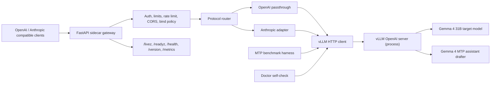

# vLLM Sidecar Gateway Design

Date: 2026-05-16
Status: Draft for user review
Scope: Build a Gemma 4 31B MTP local API gateway on top of vLLM (NVIDIA / AMD GPUs) that preserves the OpenAI + Anthropic dual-protocol surface, guardrails, doctor diagnostics, and reproducible MTP benchmarks of the MLX project.

## Goal

Provide a production-shaped local API gateway for the Google Gemma 4 31B model
with the Gemma 4 MTP assistant drafter on vLLM-compatible hardware (NVIDIA CUDA,
AMD ROCm), without rewriting any inference logic that vLLM already provides.

The gateway must:

- Speak OpenAI Chat Completions and Anthropic Messages contracts against a
  single Gemma 4 31B target model.
- Enable Gemma 4 MTP speculative decoding through the official vLLM
  `--speculative-config` surface, not private vLLM internals.
- Apply the same guardrails the MLX project ships (auth, bind policy, body
  size, rate limit, bounded admission, fail-fast unsupported features) before
  any request reaches the underlying vLLM process.
- Provide doctor diagnostics, a repeatable MTP-vs-no-MTP benchmark harness,
  and Prometheus metrics that complement vLLM's own metrics.
- Treat vLLM as an external service: the gateway must not depend on private
  vLLM Python symbols or unstable internal APIs.

## Non-Goals

This phase explicitly does not deliver:

- Tool/function calling translation (OpenAI tools, Anthropic tools, MCP).
- True multimodal request routing (image/audio/video). Vision is supported by
  upstream vLLM Gemma 4 but the gateway treats this as a future extension.
- Tokenizer-exact `count_tokens`. The gateway keeps the MLX project's
  estimated word-count behavior with an explicit header until the upstream
  vLLM tokenizer endpoint can be safely proxied.
- Distributed multi-node deployment. The first version targets a single host
  with one or two GPUs.
- Apple Silicon support. The Apple Silicon path lives in the MLX project; this
  sibling project is CUDA/ROCm only.
- Embedding, classification, or any non-text-generation surface.

## Current Evidence

vLLM upstream confirms full native support for the building blocks we need:

- vLLM Gemma 4 recipe lists `google/gemma-4-31B-it` as a first-class dense
  model and documents the single-GPU and tensor-parallel deployment patterns.
- vLLM PR `#41745` (merged May 2026) added the `Gemma4MTP` model and
  `Gemma4Proposer` speculative decoding path for all Gemma 4 variants,
  including the 31B model with the assistant drafter.
- vLLM exposes Gemma 4 MTP through the standard
  `--speculative-config '{"model":"<assistant>","num_speculative_tokens":N}'`
  CLI surface. The method is inferred as `mtp` automatically when an
  assistant checkpoint is provided.
- vLLM ships an OpenAI-compatible HTTP server, native continuous batching,
  prefix caching, CUDA graphs, paged attention, and Prometheus metrics.

Two known upstream caveats must shape the design:

- vLLM Issue `#41789` reports very low draft acceptance rate (~0.2%) for
  Gemma 4 31B MTP in some setups. The gateway's bench harness must measure
  this directly and surface the value in `doctor` output.
- vLLM Issue `#41967` reports a tool-call streaming bug under Gemma 4 MTP.
  Tool calling is already a non-goal here, but the gateway must keep
  fail-fast rejection of tool/function payloads to avoid landing on this
  upstream path.

## Approach

The gateway runs as a separate FastAPI process in front of an unmodified
vLLM OpenAI server. The vLLM process owns the model, the GPU(s), MTP,
continuous batching, and prefix caching. The gateway owns the protocol
surface, guardrails, Anthropic translation, and observability that vLLM
does not provide out of the box.

### Architecture Overview



## Components

### Profile system

A small profile registry that pins target, drafter, draft block size /
`num_speculative_tokens`, context window, sampling defaults, and the minimum
required GPU memory. Default profile name `safe80` targets a single 80 GB
NVIDIA GPU running Gemma 4 31B BF16 with the assistant drafter and
`num_speculative_tokens=4`. A `tp2` profile targets two ~40 GB GPUs.

Profiles render into:

- A canonical model alias surfaced through OpenAI `/v1/models`.
- The `vllm serve` invocation built by `vllm-mtp launch`.
- The default request parameters applied in the gateway when the client did
  not send them.

### Gateway server (FastAPI)

A small FastAPI app exposing the same operational shape as the MLX project,
adapted to a sidecar design. Endpoints:

- `GET /livez` — public, minimal liveness probe.
- `GET /readyz` — protected, reports gateway readiness and last vLLM probe
  status.
- `GET /health` — protected, returns profile, vLLM target URL, vLLM probe
  result, draft model, MTP `num_speculative_tokens`, limits, runtime
  counters, bind host, auth modes, and known feature flags.
- `GET /version` — protected, returns package version and the vLLM version
  string read from the vLLM `/version` endpoint at startup.
- `GET /metrics` — protected, emits the gateway's own Prometheus counters.
  vLLM's native `/metrics` remains available on the vLLM process; the
  gateway documents that surface but does not proxy it.
- `GET /v1/models` — protected, lists the configured aliases.
- `POST /v1/chat/completions` — protected, OpenAI passthrough.
- `POST /v1/completions` — protected, OpenAI passthrough.
- `POST /v1/messages` — protected, Anthropic adapter.
- `POST /v1/messages/count_tokens` — protected, estimated word count with
  explicit header, identical contract to the MLX project.

### Guardrails layer

Reused conceptually from the MLX project but rewritten for the sidecar
context. The guardrails are evaluated before any request is forwarded to
vLLM:

- Bearer + `x-api-key` dual auth. `/livez` is public.
- Bind policy: `127.0.0.1` allowed without API key; non-loopback hosts
  require `--api-key`.
- Request body size cap (`--max-body-mb`).
- Output cap (`--max-output-tokens`), enforced before forwarding by capping
  the client's `max_tokens` parameter.
- In-memory rate limit per credential or per client host (`--rate-limit-rpm`).
- Bounded queue (`--max-queue-size`) for in-flight gateway requests. The
  queue is intentionally generous because vLLM already batches; the
  gateway's queue exists to bound memory and surface load.
- CORS default-deny, opt-in `--cors-origin`.
- Fail-fast rejection of OpenAI `tools`, `tool_choice`, `function_call`,
  `functions`, `stop`, and `response_format` when MTP is enabled; mirror
  for Anthropic `tools`, `tool_choice`, `thinking`, `mcp`, `files`,
  `stop_sequences`.
- No-op client defaults (`tools: []`, `tool_choice: "none"`, etc.) accepted
  for client compatibility.

### vLLM HTTP client

A typed async HTTP client wrapping the vLLM OpenAI-compatible server. The
client owns:

- Connection pooling and per-request timeouts.
- A small adapter layer that builds OpenAI Chat Completions and Text
  Completions request bodies, including `max_tokens`, `temperature`,
  `top_p`, `top_k`, `seed`, and `stream` propagation.
- Response shape passthrough for OpenAI clients; consumes vLLM SSE stream
  unchanged and re-emits it as the gateway's SSE.
- A health probe used by `/readyz`, `/health`, doctor, and bench.

The client must never call private vLLM Python symbols. Everything goes over
HTTP.

### Anthropic adapter

A request and response translator with the same semantics as the MLX
project:

- Anthropic Messages payloads map to OpenAI Chat Completions: `system`
  string or content blocks become a `system` message, `messages` translate
  by role, content blocks collapse to text.
- Response maps the OpenAI completion back into Anthropic's `message`
  envelope with `content: [{type: "text", text: ...}]`, `stop_reason`,
  and `usage` translation.
- Streaming maps OpenAI SSE chunks to Anthropic's `message_start`,
  `content_block_start`, `content_block_delta`, `content_block_stop`,
  `message_delta`, `message_stop` events.
- Tool / thinking / MCP / files payloads reject with a typed
  `unsupported_feature` error before any forwarding.

### Doctor

`vllm-mtp doctor --profile safe80` runs a startup self-check:

- Confirms the gateway can import `vllm`'s OpenAI client package (HTTP
  client side, not the heavy server side).
- Hits the configured vLLM URL `/health`, `/v1/models`, and `/version`.
- Verifies the listed models include the requested target and the
  assistant drafter is configured for MTP (by issuing a tiny generation
  request that asks for one token and inspecting the response headers and
  metrics for `num_speculative_tokens > 0` evidence).
- Reports the resolved profile, target, drafter, MTP draft size, vLLM
  version, gateway version, and GPU summary (best-effort via `nvidia-smi`
  if available on the host).

Doctor must be a single command that returns a stable JSON-shaped report
with `ok: true|false` so CI and the bench harness can rely on it.

### Bench harness

`vllm-mtp bench` and `vllm-mtp bench-matrix` mirror the MLX project's
methodology but talk to vLLM over HTTP rather than calling generation
directly. The bench:

- Runs an MTP-on request and an MTP-off request against the gateway.
- The MTP-off variant is achieved by spinning the vLLM server with the
  drafter disabled (managed by the `launch` command) or by reading two
  parallel vLLM endpoints when the user maintains both.
- Records prompt TPS, generation TPS, prompt tokens, completion tokens,
  draft acceptance rate (if surfaced through vLLM `/metrics`), and
  deterministic parity for greedy decoding.
- Emits the same `BenchmarkSummary` JSON shape used by the MLX project,
  so reports remain comparable across runtimes.
- Documents that the acceptance rate value is the headline metric for
  diagnosing Issue `#41789`.

### Launch helper

`vllm-mtp launch --profile safe80` generates and runs the correct
`vllm serve` command. This isolates the rest of the codebase from vLLM CLI
drift and gives the user a single profile-aware entry point.

The launch helper produces:

```
vllm serve google/gemma-4-31B-it \
  --max-model-len 32768 \
  --gpu-memory-utilization 0.90 \
  --speculative-config '{"model":"google/gemma-4-31B-it-assistant","num_speculative_tokens":4}' \
  --host 127.0.0.1 --port 8000
```

The gateway runs separately on its own host/port and points at this vLLM
URL via `--vllm-base-url`.

## Configuration & CLI

A `Typer` CLI mirroring the MLX project's UX:

- `vllm-mtp doctor [--profile NAME]`
- `vllm-mtp generate "prompt" [--profile NAME] [--mtp/--no-mtp]`
- `vllm-mtp bench [--profile NAME] [...]`
- `vllm-mtp bench-matrix [--profile NAME] [...]`
- `vllm-mtp launch [--profile NAME] [...]`
- `vllm-mtp serve [--profile NAME] [--vllm-base-url URL] [--api-key KEY] [...]`

Profile data lives in `config/profiles.yaml`, packaged with the wheel like
the MLX project.

## Testing Strategy

- **Pure unit tests:** profile loader, guardrails (limits, bind policy,
  rate limit, body cap), Anthropic adapter translation, OpenAI request
  shaping, bench math helpers, JSON serialization. No GPU required.
- **Fake vLLM tests:** `FakeVllmServer` (httpx mock or an in-process
  FastAPI fixture) returns canned OpenAI responses to verify gateway
  passthrough, Anthropic translation, streaming SSE shape, and error
  mapping.
- **Smoke contract tests:** mirror MLX project's coverage for `/livez`,
  `/readyz`, `/health`, `/version`, `/metrics`, `/v1/models`,
  `/v1/chat/completions`, `/v1/completions`, `/v1/messages`, with
  authenticated and unauthenticated variants.
- **Doctor tests:** unit-level by mocking the vLLM endpoints; integration
  on real hardware is documented but not part of CI.
- **Bench tests:** validate JSON output shape and CLI plumbing using the
  fake vLLM server; real measurements live in the release verification
  script.
- Total target: at least the MLX project's coverage breadth (≈ 250 tests)
  before declaring v0.1.

## Risks and Mitigations

- **vLLM API drift:** all integration goes through the OpenAI HTTP surface.
  No imports from `vllm.entrypoints` internal modules.
- **MTP acceptance rate degradation (Issue #41789):** doctor reports the
  measured acceptance rate; bench surfaces it; README explicitly documents
  it as the headline regression to watch.
- **Sidecar latency overhead:** the gateway is intentionally small. SSE
  is streamed pass-through, not buffered. Token-level latency overhead is
  measured by the bench under MTP off, where the MLX project's gateway
  already shows the FastAPI overhead is negligible compared to model time.
- **Quantization parity:** the safe80 profile uses BF16 to stay aligned
  with upstream vLLM defaults. Quantized profiles (FP8, INT4) are out of
  scope for v0.1 and tracked as follow-ups.
- **Two-process operational complexity:** launch helper plus health
  probes plus doctor reduce the burden. Docker compose example documented
  in README to make local startup a single command.

## Open Questions

- Should the gateway proxy vLLM's native `/metrics` alongside its own, or
  document both surfaces separately? Default in this design: document
  separately.
- Should `bench-matrix` also iterate `num_speculative_tokens` values like
  the MLX project iterates `draft_block_size`? Default: yes, with the
  same matrix shape.
- Anthropic `count_tokens`: keep estimated word count for parity with the
  MLX project, or proxy the vLLM `/v1/tokenize` endpoint when available?
  Default: keep word-count behavior with the explicit
  `X-Gemma4-MTP-Token-Counting: estimated_word_count` header, document the
  upgrade path.
